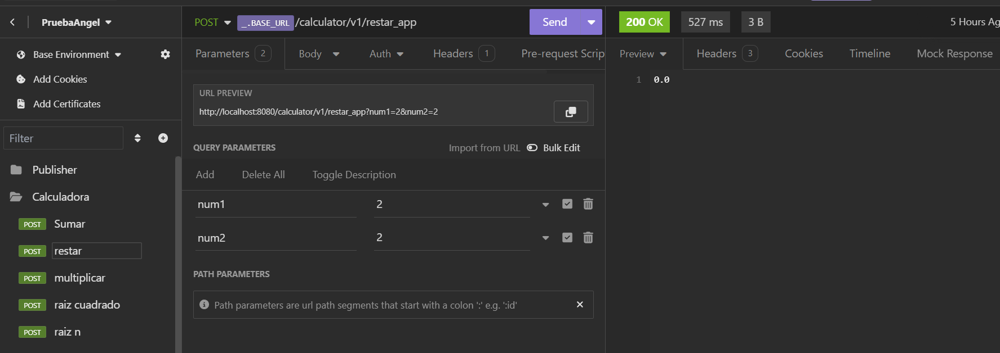
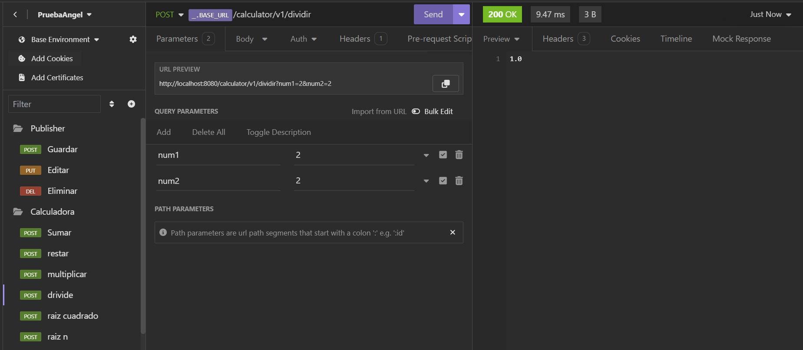
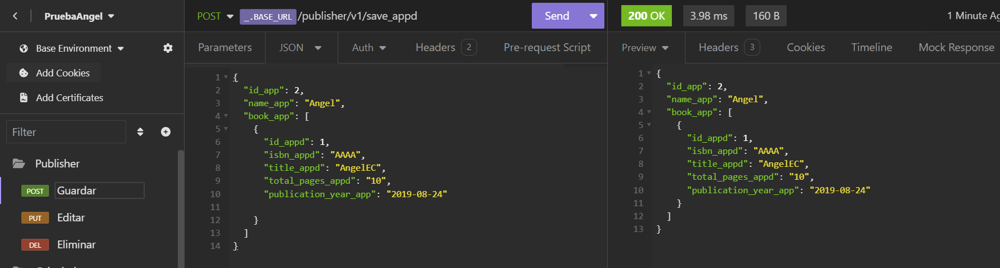

# **Select Language:** 🌍
- [Español (Spanish)](README-es.md)
- [English](README.md)

# Proyectos de Spring Boot: Calculadora y Gestor de Editoriales

Este repositorio contiene dos proyectos desarrollados con Spring Boot:

1. **Calculadora**: Una API para realizar operaciones matemáticas básicas.
2. **Gestor de Editoriales**: Una API para gestionar editoriales y sus libros.

## RESULTS
### Swagger UI Documentation

## Calculator
### Sum

### Subtraction

### Division

### Multiplication

### Square Root

### N-th Root

## Publisher Manager
### Save Publisher

### Update Publisher


## Requisitos

- Java 17 o superior
- Maven 3.8.1 o superior

## Estructura de los Proyectos

Cada proyecto tiene una estructura de capas (n-capas) que incluye controladores, servicios y repositorios.

### 1. Proyecto Calculadora

#### Descripción

Este proyecto proporciona una API para realizar operaciones matemáticas básicas como suma, resta, multiplicación, división y cálculo de raíces.

#### Endpoints

| Método | URL                   | Descripción                        |
|--------|-----------------------|------------------------------------|
| POST   | /calculator/v1/sumar  | Suma dos números enteros           |
| POST   | /calculator/v1/restar | Resta dos números decimales        |
| POST   | /calculator/v1/dividir| Divide dos números decimales       |
| POST   | /calculator/v1/multiplicar | Multiplica dos números decimales |
| POST   | /calculator/v1/raiz_cuadrada | Calcula la raíz cuadrada de un número |
| POST   | /calculator/v1/raiz_n | Calcula la raíz n-ésima de un número |

#### Ejemplo de Uso

```bash
# Sumar dos números
curl -X POST "http://localhost:8080/calculator/v1/sumar?num1=5&num2=3"
```

#### Clases Principales

- **CalculatorController**: Define los endpoints de la API.
- **CalculatorService_appd**: Contiene la lógica de negocio para realizar las operaciones.
- **CalculatorRepository**: Proporciona métodos para realizar las operaciones matemáticas.

### 2. Proyecto Gestor de Editoriales

#### Descripción

Este proyecto proporciona una API para gestionar editoriales y los libros asociados a cada editorial.

#### Endpoints

| Método | URL                          | Descripción                                      |
|--------|------------------------------|--------------------------------------------------|
| GET    | /publisher/v1/               | Redirige al Swagger UI                            |
| POST   | /publisher/v1/save_appd      | Guarda una nueva editorial                       |
| PUT    | /publisher/v1/updatePublisherById | Actualiza una editorial por ID                |
| DELETE | /publisher/v1/deleteBookById/{id} | Elimina un libro por ID                       |

#### Ejemplo de Uso

```bash
# Guardar una nueva editorial
curl -X POST "http://localhost:8080/publisher/v1/save_appd" -H "Content-Type: application/json" -d '{"id_app": 1, "name_app": "Editorial ABC", "book_app": []}'
```

#### Clases Principales

- **PublisherController_appd**: Define los endpoints de la API.
- **PublisherService_appd**: Contiene la lógica de negocio para gestionar editoriales y libros.
- **PublisherRepository_appd**: Proporciona métodos para interactuar con los datos de editoriales y libros.
- **Publisher_appd**: Modelo de datos para una editorial.
- **Book_appd**: Modelo de datos para un libro.

## Ejecución de los Proyectos

1. Clonar el repositorio:

   ```bash
   git clone https://github.com/Anyel-ec/Spring-Boot-Calculator-RESTAPI-Publisher
   cd Spring-Boot-Calculator-RESTAPI-Publisher
   ```

2. Navegar al directorio del proyecto deseado (calculadora o gestor de editoriales):

   ```bash
   cd calculadora  
   ```

3. Compilar y ejecutar el proyecto con Maven:

   ```bash
   mvn spring-boot:run
   ```

4. Acceder a la API en `http://localhost:8080`.

## Contacto

Si tienes alguna pregunta o sugerencia, no dudes en contactarme en [tu_correo@dominio.com](mailto:cyberdevmatrix@gmail.com).


