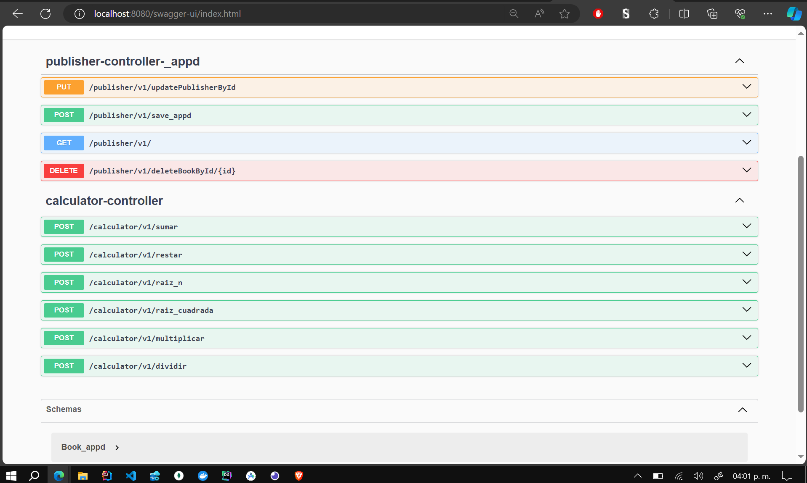
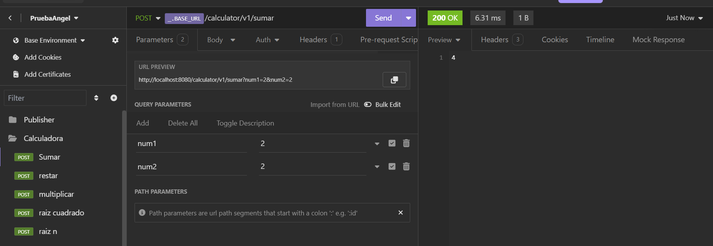
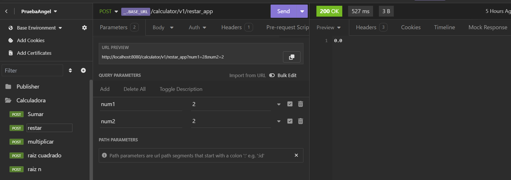
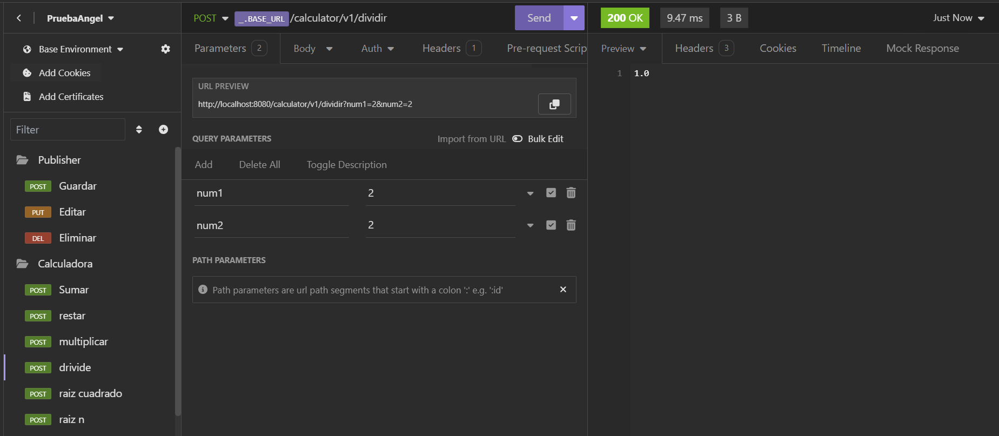
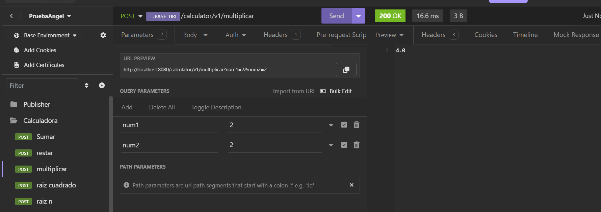
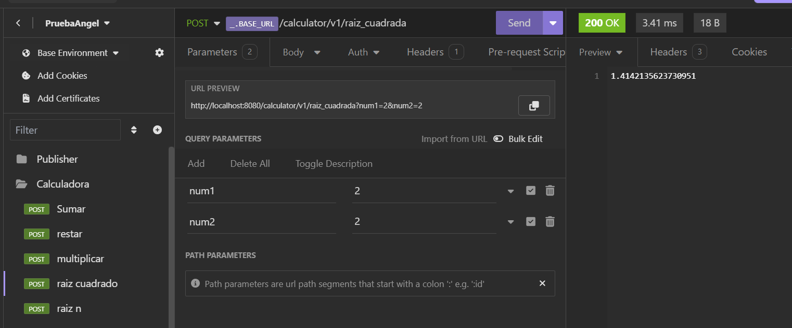
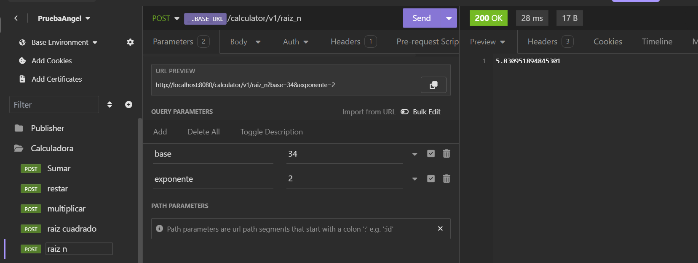
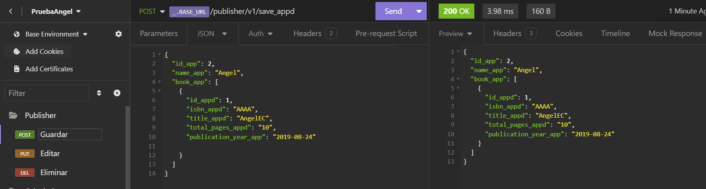
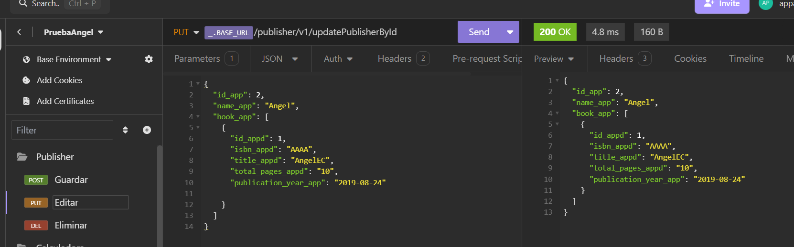

# **Select Language:** 🌍
- [Español (Spanish)](README-es.md)
- [English](README.md)

# Spring Boot Projects: Calculator and Publisher Manager

This repository contains two projects developed with Spring Boot:

1. **Calculator**: An API to perform basic mathematical operations.
2. **Publisher Manager**: An API to manage publishers and their books.

## RESULTS
### Swagger UI Documentation

## Calculator
### Sum

### Subtraction

### Division

### Multiplication

### Square Root

### N-th Root

## Publisher Manager
### Save Publisher

### Update Publisher



## Requirements

- Java 17 or higher
- Maven 3.8.1 or higher

## Project Structure

Each project follows a layered architecture (n-tier) that includes controllers, services, and repositories.

### 1. Calculator Project

#### Description

This project provides an API to perform basic mathematical operations such as addition, subtraction, multiplication, division, and root calculations.

#### Endpoints

| Method | URL                   | Description                        |
|--------|-----------------------|------------------------------------|
| POST   | /calculator/v1/sumar  | Adds two integers                  |
| POST   | /calculator/v1/restar | Subtracts two decimal numbers      |
| POST   | /calculator/v1/dividir| Divides two decimal numbers        |
| POST   | /calculator/v1/multiplicar | Multiplies two decimal numbers  |
| POST   | /calculator/v1/raiz_cuadrada | Calculates the square root of a number |
| POST   | /calculator/v1/raiz_n | Calculates the n-th root of a number |

#### Example Usage

```bash
# Add two numbers
curl -X POST "http://localhost:8080/calculator/v1/sumar?num1=5&num2=3"
```

#### Main Classes

- **CalculatorController**: Defines the API endpoints.
- **CalculatorService_appd**: Contains the business logic for performing operations.
- **CalculatorRepository**: Provides methods to perform mathematical operations.

### 2. Publisher Manager Project

#### Description

This project provides an API to manage publishers and the books associated with each publisher.

#### Endpoints

| Method | URL                          | Description                                     |
|--------|------------------------------|-------------------------------------------------|
| GET    | /publisher/v1/               | Redirects to Swagger UI                         |
| POST   | /publisher/v1/save_appd      | Saves a new publisher                           |
| PUT    | /publisher/v1/updatePublisherById | Updates a publisher by ID                     |
| DELETE | /publisher/v1/deleteBookById/{id} | Deletes a book by ID                          |

#### Example Usage

```bash
# Save a new publisher
curl -X POST "http://localhost:8080/publisher/v1/save_appd" -H "Content-Type: application/json" -d '{"id_app": 1, "name_app": "Publisher ABC", "book_app": []}'
```

#### Main Classes

- **PublisherController_appd**: Defines the API endpoints.
- **PublisherService_appd**: Contains the business logic for managing publishers and books.
- **PublisherRepository_appd**: Provides methods to interact with publisher and book data.
- **Publisher_appd**: Data model for a publisher.
- **Book_appd**: Data model for a book.

## Running the Projects

1. Clone the repository:

   ```bash
   git clone https://github.com/Anyel-ec/Spring-Boot-Calculator-RESTAPI-Publisher
   cd Spring-Boot-Calculator-RESTAPI-Publisher
   ```

2. Navigate to the desired project directory (calculator or publisher manager):

   ```bash
   cd Spring-Boot-Calculator-RESTAPI-Publisher  # or publisher_manager
   ```

3. Compile and run the project with Maven:

   ```bash
   mvn spring-boot:run
   ```

4. Access the API at `http://localhost:8080`.

## Contact

If you have any questions or suggestions, feel free to contact me at [cyberdevmatrixl@gmail.com](mailto:cyberdevmatrixl@gmail.com).
